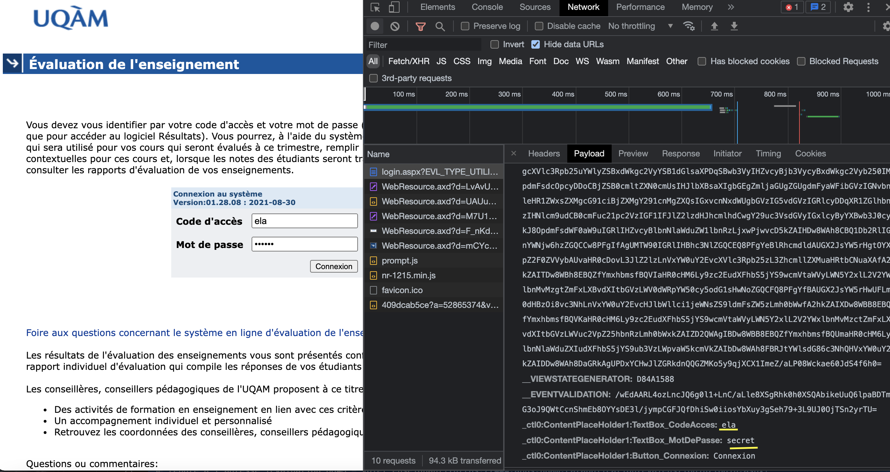

# Solutions

### Questions 1 & 2 :

 Se rendre à l'adresse [uqam.ca](http://www.uqam.ca/), ouvrir `Google Chrome DevTools`, dans `Network` selectionner `uqam.ca`. La fenetre `Headrs` apparaitra, vous y trouverai le type du serveur ainsi que l'encodage de caractères retourné par le site.

 

### Questions 3 & 4 :

 L'URL et ses paramètres pour l'horaire du cours INF5190 :
 `https://etudier.uqam.ca/cours?sigle=INF2050`

 Celui pour l'horaire du cours INF2050 : `https://etudier.uqam.ca/cours?sigle=INF2050`

## Question 5 :

 Se rendre à l'adresse [Évaluation UQAM - volet enseignant](https://www.apps.uqam.ca/application/evalens/login/login.aspx?EVL_TYPE_UTILISATEUR=ENS) -> `Google Chrome DevTools` -> `Network` -> `Playload` -> `Stop recording network log` -> entrer des identifiants et se connecter.

 Remarque : Cette méthode permet de capturer les données envoyées via la méthode POST avant d'etre transmises au serveur.

 
